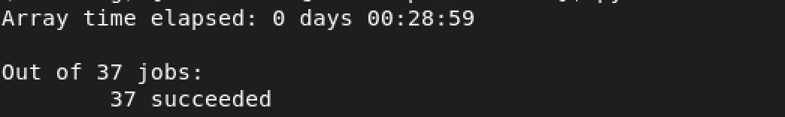
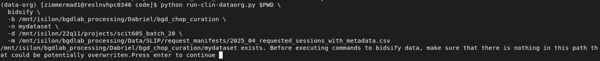
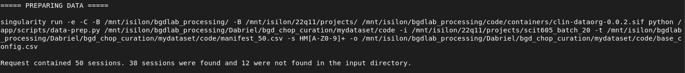
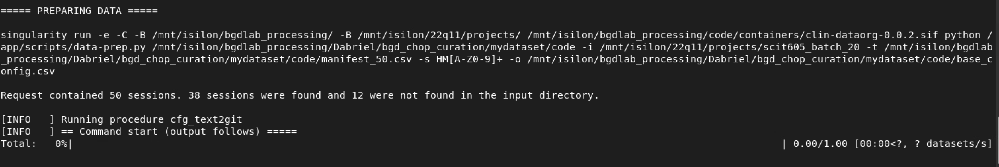
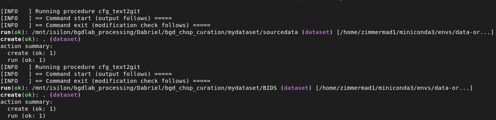
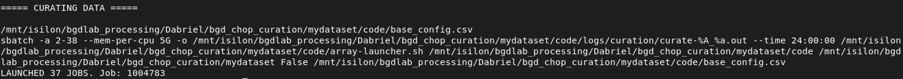
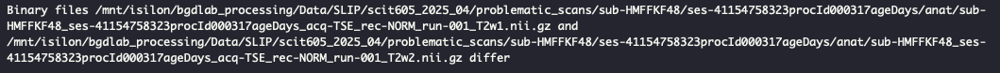

# Bidsify {#bids}

The first step in the actual curation process that uses the raw imaging data involves using [HeuDiConv](https://heudiconv.readthedocs.io/en/v1.3.1/) to convert DICOMs to NifTI. **Throughout this entire process, your data-org environment should be activated and you should be at the top level directory you created unless otherwise specified**
   
## Behind The Scenes
Behind the scenes are 3 local scripts, 3 containerized scripts, and 2 containerized python packages

### Local Scripts {#bids-local-scripts}
#### `code/run-clin-dataorg.py` {-}
  1. Runs `data_prep.py` within the container
  2. Launches `code/data-bidsify.py`
  3. Creates a SLURM job tracker `code/curation_job_summary.tsv`   
  4. Updates the job tracker by running   
  5. Concatenates output tables  

#### `code/array_launcher.sh` {-}
  1. Launches an array of SLURM jobs based on an input config  
  
#### `code/data-bidsify.py` {-}
  1. Copies over dicoms from the rawdata path to a path where the data is safe to edit   
  2. Edits the dicoms using `update_files.py` script within the container where dicoms are decompressed if they were JPEG compressed (CHOP had been compressing DICOMs that were delivered via Google Cloud Platform) for dicoms delivered through OnPrem services the DICOMS were not compressed, but to guarantee that we don't leave DICOMs compressed, this step is retained. It also blanks out so called "fragile tags" which are DICOM metadata fields that are known to cause issues with DICOM to NifTI conversion.  
  3. Runs HeuDiConv on a given session with the `heuristic.py` script within the container. This package parses DICOM metadata to label the NifTI scans as appropriately as possible. 
  4. Saves all changes to the datalad datasets (sourcedata and BIDS)   
  
  
### Containerized Scripts {#bids-contain-scripts}
  1. `update_files.py`  
    - Decompress DICOMs and redacts some metadata fields  
  2. `heuristic.py`  
    - Custom heuristic that is used to label DICOM data converted to NifI using metadata filers  
  3. `data_prep.py`   
    - Identifies which sessions from the manifest were actually delivered to Respublica   
    - Creates an output table listing the paths to the rawdata for each session  
  
### Containerized Python Packages {#bids-contain-packs}
  1. HeuDiConv  
    - Module that is used to convert DICOM to NiFTI using custom heuristics. The module `dcm2niix` does the active conversion while HeuDiConv is basically a wrapper that aggregates metadata, runs the conversion module, summarizes and tidies output. We have a modified version of HeuDiConv version 1.3.1.   
  2. gdcmv  
    - Module that decompresses DICOMs  

  
  


## Main Command 

### Arguments {#bidsify-args}
  - `WORK_DIR` corresponds to the path to the directory we initialized in the intro. 
  - `CMD` corresponds to the action we want to execute:
    - `setup` preps the dataset for curation by identifying data from the manifest that is on Respublica at the path(s) specified by the `-d` flag
    - `bidsify` does the setup step before launching bidsify jobs. If the setup step was alerady run, then it just launches the bidsify jobs. 
  - `BASE_DIR` corresponds to the top directory of the path we initially created that holds our dataset. In this walkthrough, we created `/mnt/isilon/bgdlab_processing/Dabriel/bgd_chop_curation/mydataset` to hold the code for the curation process and the output. For regular SLIP deliveries, this argument defaults to the main SLIP path `/mnt/isilon/bgdlab_processing/Data/SLIP` since curated SLIP datasets are expected to be underneath this directory like the following dataset:   
  
```
📁 Data
  ├── 📁 scit605_2025_01
  ├── 📁 scit605_2025_02
  ├── 📁 scit605_2025_03
```
  - `DATASET_NAME` will be _mydataset_ for this example. Typically for SLIP data from scit-605 lab, it is named for the monthly request you're organizing. For example if you're working on the 2026-06 request, the directory you would make is _scit605_2026_06_   
  - `DICOMS` will be the path(s) to the raw dicoms in the 22q11 fileshare. You can find this from the CHOP Data Deliveries Notion page in the `TriGBatch` column. For this example we are using the 2025-04 request which is included in batch 20 so the path is `/mnt/isilon/22q11/projects/scit605_batch_20`. You can also pass multiple paths in a comma seperated list(no spaces) to this argument 
  - `MANIFEST` is the request submitted to CHOP for imaging data including information on the scan. For regular SLIP request, these tables are at `/mnt/isilon/bgdlab_processing/Data/SLIP/request_manifests` with a standard naming convetion based on the year of the request such as _2025_04_requested_sessions_with_metadata.csv_. We will use a truncated version of that table for this example with 50 random sessions. Necessary columns for curation:   
    - `request_label` a label that denotes which dataset the data belongs to (2025-04 in this example)   
    - `pat_id`   
    - `proc_ord_id`   
    - `proc_ord_age`   
    - `sex`   
    - `race`   
    - `ethnicity`   
    - `birth_weight_kg`   
    - `birth_length_cm`  

### `bidsify` {#bidsify-cmd-1}
To run the first active curation step, you can just launch the `bidsify` command. Or in the section below you can just launch the `setup` command to identify what data you have on Respublica first and afterwards run this command. 


Before running, you can set your variables globally, or just specify them every time you run a command. To set them globally and run the bidsification step:
```{bash bidsify-1, eval=F, include=T}
cd $WORK_DIR

export BASE_DIR="/mnt/isilon/bgdlab_processing/Dabriel/bgd_chop_curation"
export DATASET_NAME="mydataset"
export DICOMS="/mnt/isilon/22q11/projects/scit605_batch_20"
export MANIFEST="/mnt/isilon/bgdlab_processing/Dabriel/bgd_chop_curation/mydataset/code/manifest_50.csv"

python run-clin-dataorg.py $PWD bidsify -b $BASE_DIR -n $DATASET_NAME -d $DICOMS -m $MANIFEST
```


or specify them each time: 
```{bash bidsify-2, eval=F, include=T}
python run-clin-dataorg.py $PWD \
  bidsify \
  -b /mnt/isilon/bgdlab_processing/Dabriel/bgd_chop_curation \
  -n mydataset \
  -d /mnt/isilon/22q11/projects/scit605_batch_20 \
  -m /mnt/isilon/bgdlab_processing/Dabriel/bgd_chop_curation/mydataset/code/manifest_50.csv

```

### `setup` {#setup-cmd}
```{bash setup-cmd, eval=F}
python run-clin-dataorg.py $PWD \
  setup \
  -b $BASE_DIR \
  -n $DATASET_NAME \
  -d $DICOMS \
  -m $MANIFEST
```


### Check Job Status {#check-stat}
Once you start running command, you can check the status of your jobs and update the job tracker `curation_job_summary.tsv` by running: 
```{bash bids-status, include=T, eval=F}
python run-clin-dataorg.py $PWD bidsify -j
```



Now we'll go through the output of this step in depth to include the terminal command output, output files/directories, and debugging

# Bidsify Output {#bids-out}

## Command Output
After running `bidsify` or `setup` command, you may be prompted to double check the output directory to ensure nothing will be overwritten. As shown below, there is only the `code` directory which holds the curation scripts. You can hit enter in the terminal to continue.
```{r bidsify-1-output, eval=T, echo=F}
cat(list.dirs("/mnt/isilon/bgdlab_processing/Dabriel/bgd_chop_curation/show_n_tell/",
          full.names = FALSE)[grepl("[A-z]+",
                                    list.dirs("/mnt/isilon/bgdlab_processing/Dabriel/bgd_chop_curation/show_n_tell/",
                                              full.names = FALSE))])
```
{#id .class width=100% height=100%}


Next after either `bidsify` or `setup`, the output will describe the data that has been located based on what was included in the manifest. 
{#id .class width=100% height=100%}


We can see that a singularity command was run such that the active curation is only ever occurring inside the container. Out of the 50 sessions, data for 38 sessions was found in the specified `$DICOMS` path. 

---
If you just ran the `setup` command this would be the end of your output. If you just ran the `bidsify` command, you can expect the following output. Thus, if you ran the `bidsify` command after separately running the `setup` command, you would only get the following output. 


Next the main datasets that will hold edited rawdata (DICOMs) and BIDSified data (NifTI) are created. Edited DICOMs are held in `sourcedata` directory and BIDSified data in the `BIDS` directory.
{#id .class width=100% height=100%}


{#id .class width=100% height=100%}


Then SLURM jobs are launched for each subject to bidsify.


{#id .class width=100% height=100%}


SLURM jobs are launched using an array based on subject. When subjects' have multiple sessions, each session is curated in succession within a single job. Thus the number of jobs launched ≠ the number of sessions, instead jobs launched = the number of subjects. 


<div style="padding: 15px; border: 1px solid #ccc; background-color: #f9f9f9; border-left: 5px solid #337ab7;">
  <p style="margin-top: 0; color: #337ab7;"><strong>💡 Tip</strong></p>
  <p>Use `watch squeue -u $CHOP_USRNAME` to keep an eye on your active SLURM jobs. Statuses update every 2 seconds.</p>
</div>


## Full Directory Tree After Bidsify {#tree-aft-bids}
```
📁 mydataset
  ├── 📁 code
    ├── 📄 array_launcher.sh
    ├── 📄 base_config.csv
    ├── 📄 batch-cubids-combine.sh
    ├── 📄 cubids-apply.sh
    ├── 📄 curation_job_summary.tsv
    ├── 📄 data-bidsify.py
    ├── 📄 run-clin-dataorg.py
    ├── 📄 run-cubids-prep.sh
    ├── 📁 logs
      ├── 📁 curation
        └── 📄 curate-<jobid>_<arrayid>.out
      ├── 📁 heudiconv
        ├── 📄 bidsify_<subject>_<session-name>.txt
        └── 📄 <subject>_heudiconv_perform.tsv
  ├── 📁 BIDS
    ├── 📄 .bidsignore
    ├── 📁 .datalad
    ├── 📁 .git
    ├── 📄 .gitattributes
    ├── 📄 .gitignore
    ├── 📁 .heudiconv
      └── 📁 HM2MOR40C
        └── 📁 ses-499739009000procId004921ageDays
          └── 📁 info
            ├── 📄 dicominfo_ses-499739009000procId004921ageDays.tsv
            ├── 📄 filegroup_ses-499739009000procId004921ageDays.tsv
            ├── 📄 HM2MOR40C_ses-499739009000procId004921ageDays.auto.txt
            ├── 📄 HM2MOR40C_ses-499739009000procId004921ageDays.edit.txt
    ├── 📄 README
    ├── 📄 scans.json
    ├── 📄 participants.tsv
    ├── 📄 participants.json
    ├── 📄 dataset_description.json
    ├── 📄 CHANGES
    ├── 📁 sub-HM2MOR40C
      ├── 📁 .datalad
      ├── 📁 .git
      ├── 📄 .gitmodules
      ├── 📄 .gitattributes
      ├── 📁 ses-499739009000procId004921ageDays
        ├── 📁 .datalad
        ├── 📁 .git
        ├── 📄 .gitmodules
        ├── 📄 .gitattributes
        ├── 📁 anat
          └── 🧠 sub-HM2MOR40C_ses-499739009000procId004921ageDays_acq-TSE_rec-DIS2D_run-002_T2w.nii.gz
          └── 📄 sub-HM2MOR40C_ses-499739009000procId004921ageDays_acq-TSE_rec-DIS2D_run-002_T2w.json
        ├── 📄 sub-HM2MOR40C_ses-499739009000procId004921ageDays_scans.tsv
  ├── 📁 sourcedata
    ├── 📁 .datalad
    ├── 📁 .git
    ├── 📄 .gitattributes
    ├── 📁 HM2MOR40C
      ├── 📁 .datalad
      ├── 📁 .git
      ├── 📄 .gitattributes
      ├── 📄 .gitmodules
      ├── 📁 499739009000procId004921ageDays
        ├── 📁 .datalad
        ├── 📁 .git
        ├── 📄 .gitattributes
        ├── 📄 dcm2niix_config.json
        ├── 📄 uuid_2ae84a22-7ce905a5-c78dce52-a28f84dd-69b3e92d.zip
        ├── 📁 uuid_2ae84a22-7ce905a5-c78dce52-a28f84dd-69b3e92d
          ├── 📁 uuid_2ae84a22-7ce905a5-c78dce52-a28f84dd-69b3e92d
            ├── 📁 STUDY
              ├── 📁 set_1
                └── 📄 MR00000.dcm
              ├── 📁 set_2
              ├── 📁 set_3
              ├── 📁 set_4
              ├── 📁 set_5
              ├── 📁 set_6
              ├── 📁 set_7
              ├── 📁 set_8
              ├── 📁 set_9
              ├── 📁 set_10
              ├── 📁 set_11
              ├── 📁 set_12
              ├── 📁 set_13
              ├── 📁 set_14
              ├── 📁 set_15
              ├── 📁 set_16
              ├── 📁 set_17
              ├── 📁 set_18
              ├── 📁 set_19
              ├── 📁 set_20
              └── 📁 set_21
  └── 📁 problematic_scans
```

<div style="padding: 15px; border: 1px solid #ccc; background-color: #f9f9f9; border-left: 5px solid #337ab7;">
  <p style="margin-top: 0; color: #337ab7;"><strong>🧠 Note</strong></p>
  <p>Don't expect the number of DICOM series here to correspond to the number of output NifTIs. This is because we only want to use structural and diffusion brain images. Sometimes we get other body parts (i.e. heart) or we get scans of other modalities (i.e. MRA) that we ignore/don't convert based on the filters in our HeuDiConv heuristic </p>
</div>


## Output Files {#bids-output}
### 1. `base_config.csv` {.unnumbered #base-config}
Output from this stage is a table within your `$WORK_DIR` listing the information for each session by subject. 
```{r base-config, eval=T, echo=F, fig.cap="Base config"}
DT::datatable(read.csv("/mnt/isilon/bgdlab_processing/Dabriel/bgd_chop_curation/mydataset/code/base_config.csv") |>
               arrange(pat_id),
             filter = list(position = "top",
                           settings = list(select = list(maxOptions = 10))),
             caption = "Base Config Used to Run HeuDiConv SLURM Jobs",
         options = list(scrollX = '300px'))

```


### 2. `curation_job_summary.tsv` {.unnumbered #cur-tsv}
Table that is used to store the status of each SLURM job you launched.
```{r cur-job-summary, eval=T, echo=F, fig.cap="Curation job summary"}
DT::datatable(read_tsv("/mnt/isilon/bgdlab_processing/Dabriel/bgd_chop_curation/mydataset/code/curation_job_summary.tsv",
                      show_col_types = FALSE) |>
               arrange(pat_id),
  filter = list(position = "top",
                settings = list(select = list(maxOptions = 10))),
  caption = "Curation Job Summary",
  options = list(scrollX = '300px'))
```


### 3. `sourcedata` {.unnumbered #sourcedata}
Directory containing edited DICOMs. The original raw data is either compressed into a single ZIP file at the specified `$DICOMS` path or as a directory. Paths are nested such that (the first subdirectory is a result of the GCP deidentification process in data delivered via GCP), then the subsequent directory is the DICOM 'Study', and then the DICOM 'Series' featuring individual DICOM 'instances' (basically slices of the brain from the end of one axis to another).[^1]

[^1]: This [source](https://towardsdatascience.com/understanding-dicom-bce665e62b72/) can help you understand the structure of a DICOM directory.


An example session delivered via GCP
```
📁 /mnt/isilon/22q11/projects/scit605_batch_19/HM3JE4QTC_307326634746_577  
  ├── 📁 GCPDicom_deid_uuid_69ecda2e-d2d87192-a9e6efab-38468865-d1869b98  
    ├── 📁 1.3.6.1.4.1.11129.5.1.320095716370311217869815258082494720144  
      ├── 📁 1.3.6.1.4.1.11129.5.1.110467961722322632112251159407706174818  
        └── 📄 1.3.6.1.4.1.11129.5.1.214251349795671109240889002528357517753.dcm
```


Our working example session delivered via OnPrem
```
📁 /mnt/isilon/22q11/projects/scit605_batch_20/HM2MOR40C_499739009000_4921  
  ├── 📁 uuid_2ae84a22-7ce905a5-c78dce52-a28f84dd-69b3e92d.zip
```


Here is an example subject's `sourcedata` tree.
```
📁 sourcedata/HM2MOR40C_499739009000_4921  
  ├── 📁 .datalad
  ├── 📁 .git
  ├── 📄 .gitattributes
  ├── 📁 uuid_2ae84a22-7ce905a5-c78dce52-a28f84dd-69b3e92d.zip
  ├── 📁 uuid_2ae84a22-7ce905a5-c78dce52-a28f84dd-69b3e92d  
    ├── 📁 STUDY 
      ├── 📁 'MR ANTERIOR'  
        └── 📄 MR00000.dcm
      ├── 📁 'MR asl_3d_tra_fast'  
      ├── 📁 'MR AX'  
      ├── 📁 'MR AX-2'  
      ├── 📁 'MR AX MPR'  
      ├── 📁 'MR BASILAR'  
      ├── 📁 'MR COR'  
      ├── 📁 'MR COR2'  
      ├── 📁 'MR localizer'  
      ├── 📁 'MR relCBF_GREY MOSAIC'  
      ├── 📁 'MR resolve_4scan_trace_tra_p2_s2_224_ADC'  
      ├── 📁 'MR resolve_4scan_trace_tra_p2_s2_224_TRACEW'  
      ├── 📁 'MR t1_mprage_sag_p2_iso_0.9'  
      ├── 📁 'MR t2_tirm_tra_darkfluid'  
      ├── 📁 'MR t2_tse_cor s2'  
      ├── 📁 'MR t2_tse_tra'  
      ├── 📁 'MR TOF_3D_multislab brain MRA_cs_4.4'
      ├── 📁 'MR TOF_3D_multislab brain MRA_cs_4.4_MIP_COR'
      ├── 📁 'MR TOF_3D_multislab brain MRA_cs_4.4_MIP_Radials'
      ├── 📁 'MR TOF_3D_multislab brain MRA_cs_4.4_MIP_SAG'
      ├── 📁 'MR TOF_3D_multislab brain MRA_cs_4.4_MIP_SAG'
      └── 📁 'MR TOF_3D_multislab brain MRA_cs_4.4_MIP_TRA'  
```

edited `sourcedata`

```
📁 sourcedata
  ├── 📁 .datalad
  ├── 📁 .git
  ├── 📄 .gitattributes
  ├── 📁 HM2MOR40C
    ├── 📁 .datalad
    ├── 📁 .git
    ├── 📄 .gitattributes
    ├── 📄 .gitmodules
    ├── 📁 499739009000procId004921ageDays
      ├── 📁 .datalad
      ├── 📁 .git
      ├── 📄 .gitattributes
      ├── 📄 dcm2niix_config.json
      ├── 📄 uuid_2ae84a22-7ce905a5-c78dce52-a28f84dd-69b3e92d.zip
      ├── 📁 uuid_2ae84a22-7ce905a5-c78dce52-a28f84dd-69b3e92d
        ├── 📁 uuid_2ae84a22-7ce905a5-c78dce52-a28f84dd-69b3e92d
          ├── 📁 STUDY
            ├── 📁 set_1
              └── 📄 MR00000.dcm
            ├── 📁 set_2
            ├── 📁 set_3
            ├── 📁 set_4
            ├── 📁 set_5
            ├── 📁 set_6
            ├── 📁 set_7
            ├── 📁 set_8
            ├── 📁 set_9
            ├── 📁 set_10
            ├── 📁 set_11
            ├── 📁 set_12
            ├── 📁 set_13
            ├── 📁 set_14
            ├── 📁 set_15
            ├── 📁 set_16
            ├── 📁 set_17
            ├── 📁 set_18
            ├── 📁 set_19
            ├── 📁 set_20
            └── 📁 set_21
```

  

This rawdata is:  
  1. copied over to the new `sourcedata` session specific directory for each subject (if it's a ZIP file it is) unzipped  
  2. names of the extracted directories edited to remove the spaces within the original names (spaces in filenames/directories are a No-No for linux!)  
  3. decompressed within the container using Singularity  
  4. metadata/SOP tags[^2]  

  [^2]: Metadata fields associated with each DICOM redacted to avoid downstream complications


### 4. `BIDS` {.unnumbered #bids-outputdir}
NifTIs made from `sourcedata` DICOMs along with standard BIDS accessory files. Each subject has their own directory, under which are session directories and finally modality specific (anat or dwi) directories.  The `<subject-id>_<session-id>_scans.tsv>` tables feature the filename(s) of the scans included in the session. The BIDS accessory files include: README, CHANGES, participants.json, participants.tsv, dataset_description.json, and scans.json. Please read the [BIDS documentation](https://bids-specification.readthedocs.io/en/stable/introduction.html) to understand these files. 


### 5. `problematic_scans` {.unnumbered #prob-scans}
This directory contains data that either didn't successfully convert to NifTI or converted data couldn't be appropriately named with the current configuration. An example:
```
📁 sub-HMFFKF48
  ├── 📁 ses-41154758323procId000317ageDays
    ├── 📁 anat
      ├── 📄 sub-HMFFKF48_ses-41154758323procId000317ageDays_acq-TSE_rec-NORM_run-001_T2w1.json
      ├── 🧠 sub-HMFFKF48_ses-41154758323procId000317ageDays_acq-TSE_rec-NORM_run-001_T2w1.nii.gz
      ├── 📄 sub-HMFFKF48_ses-41154758323procId000317ageDays_acq-TSE_rec-NORM_run-001_T2w2.json
      └── 🧠 sub-HMFFKF48_ses-41154758323procId000317ageDays_acq-TSE_rec-NORM_run-001_T2w2.nii.gz
```
The issue here is that these scans were given the exact same name by our heuristic through HeuDiConv processing so to prevent overwriting, they were given a numbered suffix which isn't BIDS compliant. Unsure why this happens, but the files do indeed differ when we check:
```{bash check-file-diff, eval=F, include=T}

diff /mnt/isilon/bgdlab_processing/Data/SLIP/scit605_2025_04/problematic_scans/sub-HMFFKF48/ses-41154758323procId000317ageDays/anat/sub-HMFFKF48_ses-41154758323procId000317ageDays_acq-TSE_rec-NORM_run-001_T2w1.nii.gz /mnt/isilon/bgdlab_processing/Data/SLIP/scit605_2025_04/problematic_scans/sub-HMFFKF48/ses-41154758323procId000317ageDays/anat/sub-HMFFKF48_ses-41154758323procId000317ageDays_acq-TSE_rec-NORM_run-001_T2w2.nii.gz
```

so this is why these scans were moved out of the BIDS directory. 


### 6. Hidden Files and Directories {.unnumbered #hidden-dirs}

#### .heudiconv {-}
The output of HeuDiConv processing includes a table `<pat_id>/<session_id>/info/dicominfo_<session_id>.tsv` with all the metadata for each DICOM series that are used to heuristically label scans. 


<div style="padding: 15px; border: 1px solid #ccc; background-color: #f9f9f9; border-left: 5px solid #337ab7;">
  <p style="margin-top: 0; color: #337ab7;"><strong>⚠️ Tip</strong></p>
  <p>If this file exists prior to running the bidsify jobs, HeuDiConv will use the existing table instead of creating a new one so if you need to relaunch a bidsify job manually, you'll need to remove the specific session dicominfo table </p>
</div>


#### .git, .datalad, .gitattributes, .gitmodules {-}
Since we are using datalad for data provenance, there will be hidden directories and files that are made to enable this. See the [datalad docs](https://docs.datalad.org/en/stable/index.html) for more explanations on how datalad works and the purpose/utility of these files and directories.

### .bidsignore {-}
This file is output after running HeuDiConv and is used primarily for running [BIDs apps](https://bids.neuroimaging.io//tools/bids-apps.html). You would add a regex pattern or exact relative filepath/filename for data you want your BIDs app to ignore. 

### 7. HeuDiConv run tracker {-}
Our heuristic file adds run number via an incremental process that uses a text file to keep track of unique filenames. When there are numerous of similar filenames, the run number is incremented by 1. This file is kept in a completely different directory and is deleted once you run the `cubids` or `cubids-prep` steps. 

```
📁 Data
  ├── 📁 tmp_heudiconv
    └── HM2MOR40C_499739009000_4921_501679.txt
```
In the above file:
```{r show-run-tracker, eval=T, echo=F, message=F}
readLines("/mnt/isilon/bgdlab_processing/Dabriel/bgd_chop_curation/HM2MOR40C_499739009000_4921_501679.txt")
```


Here there are 2 DICOM series that were labelled by our heuristic as "acq-TSE_rec-DIS2D_T2w". The first instance will be named like _acq-TSE_rec-DIS2D_T2w_run-001_ while the next instance will be _acq-TSE_rec-DIS2D_T2w_run-002_. HeuDiConv has their own method of incrementing runs for similarly named files but I found it to be unreliable. This could have been fixed in newer versions of HeuDiConv (dataorg container uses version 1.3.1) but I haven't tried them out. We expect that HeuDiConv is following the order that the series' were acquired in such that any _run-001_ is occurring before _run-002_ for the same acqusition types but **haven't officially checked**. This could be something to verify in the future. From the [HeuDiConv docs](https://heudiconv.readthedocs.io/en/latest/api/dicoms.html), the below DICOM metadata is used to order series, but in our data these fields are usually redacted/removed during the de-identification process.   


>The following fields are checked in order
>
AcquisitionDate & AcquisitionTime (0008,0022); (0008,0032)
AcquisitionDateTime (0008,002A);
SeriesDate & SeriesTime (0008,0021); (0008,0031)

So this will be a mystery to solve! (In reality you could probably open a few sessions in NilRead and compare with the dicominfo table to see if the order of SeriesDescriptions are the same)  


## Logs {#bids-logs}
Since we are launching SLURM jobs, we are writing job output to a `logs` directory underneath the specified `WORK_DIR`. Within the `logs` directory are 2 subdirectories with logs for the bidsify jobs (`curation`) and then another one for the heudiconv command output (`heudiconv`).  

### curation logs {.unnumbered #cur-logs}
Curation logs for our example:
```{css, echo=FALSE}
.scroll-100 {
  max-height: 200px;
  overflow-y: auto;
  background-color: inherit;
}
```

```{r cat-curation-log, eval=T, echo=F, class.output="scroll-100"}
readLines("/mnt/isilon/bgdlab_processing/Dabriel/bgd_chop_curation/mydataset/code/logs/curation/curate-1004783_10.out")
```


### heudiconv logs {.unnumbered #heudi-logs}
heudiconv logs for our example `logs/heudiconv/bidsify_HM2MOR40C_499739009000procId004921ageDays.txt` with the output from the singularity command to run HeuDiConv inside the data-org container:


```{r cat-cur-logs, echo=F, eval=T, class.output="scroll-100"}
readLines("/mnt/isilon/bgdlab_processing/Dabriel/bgd_chop_curation/mydataset/code/logs/heudiconv/bidsify_HM2MOR40C_499739009000procId004921ageDays.txt")
```

Also in this directory are subject specific heudiconv performance review tables. `logs/heudiconv/HM2MOR40C_heudiconv_perform.tsv`
```{r subject-heudiconv-perform-tables, eval=T, echo=F, fig.cap='HeuDiConv performance'}
DT::datatable(read_tsv("/mnt/isilon/bgdlab_processing/Dabriel/bgd_chop_curation/HM2MOR40C_heudiconv_perform.tsv",
         show_col_types = FALSE),
          filter = list(position = "top",
                           settings = list(select = list(maxOptions = 10))),
         caption = "HeuDiConv Performance Table",
         options = list(scrollX = '300px'))
```
Where the columns represent:   
  - **subject_id**   
  - **session_id**   
  - **expected_output** number of series in the `sourcedata` session directory   
  - **actual_output** number of series evaluated by HeuDiConv, extracted output log (line 4 in from the above log "INFO: Generated sequence info for 1 studies with 20 entries total")   
  - **expected_anat_scans** number of expected anatomical modality scans based on the number of instances of "{bids_subject_session_dir}/anat" in the log (e.g. line 115)   
  - **actual_anat_scans** number of NifTIs output in the `BIDS/<subject-id>/<session-id>/anat` directory   
  - **expected_dwi_scans** number of expected anatomical modality scans based on the number of instances of "{bids_subject_session_dir}/dwi" in the log   
  - **actual_dwi_scans** number of NifTIs output in the `BIDS/<subject-id>/<session-id>/dwi` directory   
  - **first_run** if/else the _expected_output_ == _actual_output_. If equal, 'success'. If not equal, 'missed'   
  - **final_run** if/else the _expected_output_ == _actual_output_ after relaunching. If equal, 'success'. If not equal, 'missed'   


<div style="padding: 15px; border: 1px solid #ccc; background-color: #f9f9f9; border-left: 5px solid #337ab7;">
  <p style="margin-top: 0; color: #337ab7;"><strong>🔑 Note</strong></p>
  <p>These subject specific heudiconv performance review table will be concatenated into a larger 'heudiconv_performance.tsv' table. </p>
</div>


## An Explanation of HeuDiConv
Edited DICOMs from `sourcedata` are funneled through HeuDiConv to get converted to NifTI. HeuDiconv uses a custom [heuristic](https://github.com/BGDlab/dataorg-container/blob/main/scripts/heuristic.py) that looks at the DICOM metadata to name scans and outputs a table containing information on each series (the .heudiconv dicominfo table). The custom heuristic also uses custom dictionaries based on input from CHOP's head radiologist Arastoo Voussough to aid in labeling scans appropriately: [modality dictionary](https://github.com/BGDlab/dataorg-container/blob/main/scripts/mod_dict.json), [label dictionary](https://github.com/BGDlab/dataorg-container/blob/main/scripts/label_dict.json), [acqusition dictionary](https://github.com/BGDlab/dataorg-container/blob/main/scripts/acq_dict.json). These should be updated periodically based on CHOP's continued expansion. 

We run HeuDiConv within the data-org container to maintain reproducibility and because we needed to fix issues in the HeuDiConv package. See the container maintenance page for more information. To do so, we run this singularity command:
```
usage: singularity run -e -C -B /mnt/isilon/bgdlab_processing/ \
              --env 'HEUDICONV_FILELOCK_TIMEOUT=45' \
              /mnt/isilon/bgdlab_processing/code/containers/clin-dataorg-0.0.2.sif \
              heudiconv \
              [--files $DICOM_STUDY] \
              [-o $BIDS] \
              [-f /app/scripts/heuristic.py] \
              [-s $PAT_ID] \
              [-ss $SES_NAME] \
              [-c dcm2niix] \
              [--dcmconfig $DCMCONFIG -b 2>&1 | tee $LOG_OUTPUT]
```

### HeuDiConv Arguments

- `DICOM_STUDY` path to the DICOM study, format `/SOURCEDATA/SUBJECT/SES-NAME/../DICOM-STUDY`
- `BIDS` path to BIDS
- `PAT_ID` subject identifier
- `SES_NAME` session identifier, example: 255522594163procId002987ageDays
- `DCMCONFIG` path to the dcm2niix command config, format `/SOURCEDATA/SUBJECT/SES-NAME/dcm2niix_config.json`
- `LOG_OUTPUT` path to the heudiconv log output, format `/LOGS/heudiconv/bidsify_SUBJECT_SES-NAME.txt`

### HeuDiConv Output
Now we will show the HeuDiConv output from our example:
```{r heudiconv-info-table, eval=T, echo=F, message=F, fig.cap="Incomplete HeuDiConv dicom info table"}
DT::datatable(read_tsv("/mnt/isilon/bgdlab_processing/Dabriel/bgd_chop_curation/mydataset/BIDS/.heudiconv/HM2MOR40C/ses-499739009000procId004921ageDays/info/dicominfo_ses-499739009000procId004921ageDays.tsv"),
              filter = list(position = "top",
                           settings = list(select = list(maxOptions = 10))),
              caption = "Dicom Info Table",
              options = list(scrollX = '300px'))
```

Because HeuDiConv was relaunched for this subject/session, the HeuDiconv info table is incomplete. We can refer back to the \@ref(fig:subject-heudiconv-perform-tables) for this subject/session to see why


We can see that there were 21 expected series to review, but only 20 were initially registered through HeuDiConv. Due to this, the script will remove the output and run HeuDiConv again. In the next section we'll go through our logs to understand what happened.


## Debugging 🐞
In our example, HeuDiConv relaunched due to a failure to register all the available DICOM series. To understand what this means, you can copy the HeuDiConv singularity command from the logs (check the `curation_job_summary.tsv` to find which logfile it's in, this example is in `curate-1004783_10.out`), edit it so that the output goes into a separate directory where you can review the output, and then run it in the terminal.
```{bash heudiconv-singularity-cmd, include=T, eval=F}
singularity run -e -C -B /mnt/isilon/bgdlab_processing/ --env 'HEUDICONV_FILELOCK_TIMEOUT=45' \
  /mnt/isilon/bgdlab_processing/code/containers/clin-dataorg-0.0.2.sif \
  heudiconv 
  --files /mnt/isilon/bgdlab_processing/Dabriel/bgd_chop_curation/mydataset/sourcedata/HM2MOR40C/499739009000procId004921ageDays/uuid_2ae84a22-7ce905a5-c78dce52-a28f84dd-69b3e92d/uuid_2ae84a22-7ce905a5-c78dce52-a28f84dd-69b3e92d/STUDY \
  -o /mnt/isilon/bgdlab_processing/Dabriel/bgd_chop_curation/mydataset/test \
  -f /app/scripts/heuristic.py \
  -s HM2MOR40C \
  -ss 499739009000procId004921ageDays \
  -c dcm2niix --dcmconfig /mnt/isilon/bgdlab_processing/Dabriel/bgd_chop_curation/mydataset/sourcedata/HM2MOR40C/499739009000procId004921ageDays/dcm2niix_config.json -b 2>&1 | tee /mnt/isilon/bgdlab_processing/Dabriel/bgd_chop_curation/mydataset/test/bidsify_HM2MOR40C_499739009000procId004921ageDays.txt
```


Once the command is run, we now can look at the complete HeuDiConv info file
```{r info-table-2, eval=T, echo=F, fig.cap="Complete HeuDiConv dicom info table"}
DT::datatable(read_tsv("/mnt/isilon/bgdlab_processing/Dabriel/bgd_chop_curation/mydataset/test/.heudiconv/HM2MOR40C/ses-499739009000procId004921ageDays/info/dicominfo_ses-499739009000procId004921ageDays.tsv",
                     show_col_types = FALSE) |>
              mutate(num = as.numeric(str_extract(dcm_dir_name, "[0-9]+"))) |>
              arrange(num) |>
              select(dcm_dir_name, series_id, series_files, 
                      study_description, protocol_name, 
                      series_description),
  filter = list(position = "top",
                           settings = list(select = list(maxOptions = 10))),
         caption = "HeuDiConv Dicom Info",
         options = list(scrollX = '300px'))
```


Now we have found the error! When running HeuDiConv initially, all but `set_2` was registered. As of Mar 2026 I'm not sure why this happens 😞. After relaunch, we successfully register all 21 sets, but since the relaunch process overwrites the HeuDiConv info table, we don't have proof there. But, we do have proof in the `bidsify_redo` logs for this subject/session! 


First we look at one DICOM from `set_2` to see what the **SeriesDescription** is. 
```{python load-dcm, eval=T}
from pydicom import dcmread
ds = dcmread("/mnt/isilon/bgdlab_processing/Dabriel/bgd_chop_curation/mydataset/sourcedata/HM2MOR40C/499739009000procId004921ageDays/uuid_2ae84a22-7ce905a5-c78dce52-a28f84dd-69b3e92d/uuid_2ae84a22-7ce905a5-c78dce52-a28f84dd-69b3e92d/STUDY/set_16/MR000000.dcm")
ds["SeriesDescription"]
```


Now we can look in the logs to see if the 'AX' series was registered
```{bash trouble-1, eval=T}
grep 'Description: ax' /mnt/isilon/bgdlab_processing/Dabriel/bgd_chop_curation/mydataset/code/logs/heudiconv/bidsify_redo_HM2MOR40C_499739009000procId004921ageDays.txt
```


Now we see that there are 2 instances of _Description: ax_ which corresponds to `set_2` and also `set_16`, so now we now for sure that the relaunch worked! In this example the relaunch isn't consequential - we don't convert those types of scans (MRA). But there isn't a way to predict which series HeuDiConv might fail to register, so if they failed to register an MPRAGE instead, that would be consequential for downstream analysis.

<div style="padding: 15px; border: 1px solid #ccc; background-color: #f9f9f9; border-left: 5px solid #337ab7;">
  <p style="margin-top: 0; color: #337ab7;"><strong>🔨 Feature Request</strong></p>
  <p>Here we have our first feature request! There was a problem with the initial HeuDiConv run for sub-HM2MOR40C ses-499739009000procId004921ageDays such that all the the expected DICOM series were evaluated. Thus, the bidsify job was automatically relaunched, this time on a per series base (instead of per session base). When this happens, HeuDiConv is run once for each series, and the HeuDiConv output gets overwritten. Future iterations of the curation process should include a way to prevent this overwriting.</p>
</div>

## Saving Progress
Now that we have finished the bidsfication step, we will need to manually save our dataset. Switch into the `BIDS` directory and run datalad save    
`cd /mnt/isilon/bgdlab_processing/Dabriel/bgd_chop_curation/mydataset/BIDS`   
or since you should be in your `code` directory, you can use a positional argument to change directories `../B` then hit tab and the path should complete to `../BIDS`. This `../` mean to move one directory up. Use it multiple times to move multiple levels up, using tab completion to make sure your destination is actually there.  

Now in your `BIDS` directory (with your data-org environment activated):

💡 To speed this process up, you can open the `.gitignore` file, add _.heudiconv_ to it, save it, and then run below command.

```{bash, eval=F, include=T}
srun --time 12:00:00 --mem 5G datalad save -m 'Bidsification first pass' -J auto
```
Submitting it as an srun job ensures that the command isn't killed by the terminal for using too much memory. This happens when you have large datasets. Not sure the limit on what causes the crash (whether it be 100 sessions or 1500 sessions) so it's good to just always run this as an srun job. No way to predict how long it will take so usually good to just switch to another task and come back to the dataset later. 


Now we continue to the next stage! ➡️