# CuBIDS {#cubids}

Now we will complete the 2nd stage of curation that involves grouping our data together to describe our scans in more detail. We are using a developmental version of [CuBIDS (v1.2.1.dev5+g0be1b9a26.d20250926)](https://cubids.readthedocs.io/en/1.2.0/) that we manually edited inside our data-org container to work specific for our lab! See the data-org maintanence page for more informaiton.

In brief, CuBIDS aggregates scan metadata and groups them based on their similarities, allowing specified tolerance levels for numerical fields. For example, we allow a 0.05 second tolerance range for `RepetitionTime` such that 1 scan with a TR or 1.0 and another with TR of 1.05 grouped together. We set these tolerances in a [config file](https://github.com/BGDlab/dataorg-container/blob/main/scripts/config.yml) used in the command to run the `cubids group`. Further, we use the tables that CuBIDS outputs with the aggregated metadata to run a [custom scan identification script](https://github.com/BGDlab/dataorg-container/blob/main/scripts/identifyFilesFromCubids.py) based on the most common acquisitions from CHOP. With this we use very specific tolerance ranges and other string filters to identify scans as T1w, T2w, or FLAIR as well as the standard MPRAGE and others. 

One way you can think about the utility of CuBIDS is through the recovery of un-identifiable scans that our heuristic in HeuDiConv fail to identify:

```{python combine-cubids-tables, eval=T, message=F, include=F}
import pandas as pd, os, glob, re

dfList = []
for tbl in glob.glob("/mnt/isilon/bgdlab_processing/Data/SLIP/scit605*/BIDS/code/CuBIDS/run01_summary_edited.tsv"):
  df = pd.read_csv(tbl, sep="\t")
  df['dataset'] = re.findall('scit605_[0-9]+_[0-9]+', tbl)[0]
  dfList.append(df)
  
combo = pd.concat(dfList).reset_index()

  
```

```{r recovered-scans, eval=T, include=F}
combo <- py$combo

recovered <- combo |>
  filter(grepl("unknown", EntitySet) &
           grepl("T1w|T2w|FLAIR|dwi", RenameEntitySet) &
           ProtocolName != "AXIAL tse post gad") |>
  select(ProtocolName, SeriesDescription, RenameEntitySet, Counts) |>
  mutate(NewFilename = str_replace(RenameEntitySet, "acquisition","acq"),
         NewFilename = str_replace(NewFilename, "suffix-",""),
         NewFilename = str_remove(NewFilename, 'datatype-anat_')) |>
  group_by(ProtocolName, SeriesDescription, NewFilename) |>
  summarise(Scans = n()) |>
  arrange(desc(ProtocolName)) 
n_rec_scans = sum(recovered$Scans)
str_glue("Overall, CuBIDS is able to recover {n_rec_scans} scans via CuBIDS.")
```

```{r rec-scans-tbl,eval=T, echo=F, message=F, fig.cap="Recovered scans from CuBIDS"}
DT::datatable(recovered,
              caption = "Random 10 Recovered Scans",
              filter = list(position = "top",
                           settings = list(select = list(maxOptions = 10))),
              options = list(scrollX = '300px'))


```

## Main Command

This command executes each substage of the CuBIDS process via one command. If at any point an individual command fails, an error message is output and processing stopped. 

The first line sets up an interactive SLURM job (so we can see the output and be able to increase the memory and time needed) with a time limit of 12 hours and 8 GB of memory. The next line launches the `run-cubids-prep.sh` script. 

```{bash main-cubids-cmd, eval=F}
cd $WRKDIR
srun --time 12:00:00 --mem 8G \
  bash run-cubids-prep.sh $PWD $DATASET_NAME
```
Immediate output refers to the interactive SLURM job we launched.
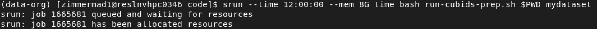


Next we can see the command launched for `cubids-prep` and the output of cleaning up the intermediate files from the bidsify step 
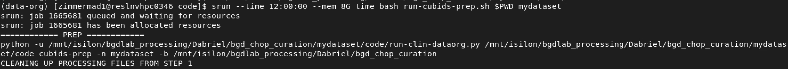 


Next we will see the singularity command output that will run `cubids add-nifti-info` command inside the container. Also see some output from datalad concerning the unlocking of files to make and save changes to the dataset
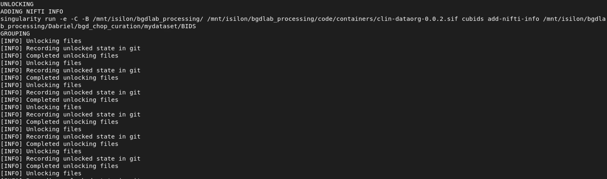
Following, we see the output of running `cubids group` with the singularity command output.
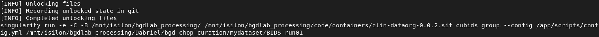

Next, we see output for the scan identification step showing the singularity command and then the output of running the script.
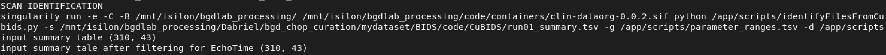

Finally we see the script submitting the command to run `cubids apply` as a separate SLURM job. 
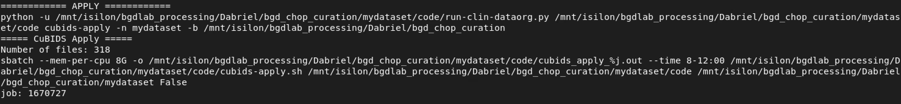

Since this example has less than 4000 scans, `cubids apply` is run as a single job. 


## CuBIDS Stages {#cubids-stages}

Now we will explain in more detail each step that the process went through. 

### cubids add-nifit-info {#add-nifti-info}
Here we are adding information to the NifTI sidecars (JSON). See CuBIDS documentation [cubids add-nifti-info](https://cubids.readthedocs.io/en/latest/cli.html#add-nifti-info) for more information.   
We can see the shortened original version of one of the JSONs for scan    `BIDS/sub-HM2MOR40C/ses-499739009000procId004921ageDays/anat/sub-HM2MOR40C_ses-499739009000procId004921ageDays_acq-MPRAGE_rec-DIS2D_run-001_T1w.nii.gz`


```
{
  "AcquisitionMatrixPE": 256,
  "AcquisitionNumber": 1,
  "BodyPart": "BRAIN",
  "ConversionSoftware": "dcm2niix",
  "ConversionSoftwareVersion": "v1.0.20241211",
  "DeviceSerialNumber": "176559",
  "EchoTime": 0.00252,
  "FlipAngle": 9,
  "HeudiconvVersion": "1.3.1",
  "ImageOrientationPatientDICOM": [0, 1, 0, 0.122442, 0, -0.992476],
  "ImageType": [
    "ORIGINAL",
    "PRIMARY",
    "M",
    "NORM",
    "DIS2D",
    "MFSPLIT",
    "MAGNITUDE"
],
  "ImagingFrequency": 123.261334,
  "InPlanePhaseEncodingDirectionDICOM": "ROW",
  "InstitutionAddress": "KOP Specialty Care Center 550 South Goddard Blvd KING OF PRUSSIA, PA 19406",
  "InstitutionName": "KOPH SCC MRI",
  "InversionTime": 0.9,
  "MRAcquisitionType": "3D",
  "MagneticFieldStrength": 3,
  "Manufacturer": "Siemens",
  "ManufacturersModelName": "MAGNETOM Vida",
  "Modality": "MR",
  "NonlinearGradientCorrection": true,
  "PatientPosition": "HFS",
  "PercentPhaseFOV": 100,
  "PercentSampling": 100,
  "PhaseEncodingSteps": 256,
  "PixelBandwidth": 179,
  "ProcedureStepDescription": "MR BRAIN W & W/O IV CONTRAST",
  "ProtocolName": "t1_mprage_sag_p2_iso_0.9",
  "ReconMatrixPE": 256,
  "RepetitionTime": 1.9,
  "SAR": 0.123027,
  "ScanOptions": "PER",
  "ScanningSequence": "GR",
  "SequenceVariant": "SK",
  "SeriesDescription": "t1_mprage_sag_p2_iso_0.9",
  "SeriesNumber": 9,
  "SliceThickness": 0.9,
  "SoftwareVersions": "syngo MR XA50",
  "StationName": "KOP MR2",
  "StudyDescription": "MR BRAIN W & W/O IV CONTRAST",
  "dcmmeta_affine": [
    [0.8939999938011169, 0.0, 0.10522359609603882, -96.42701721191406],
    [0.0, 0.859375, 0.0, -113.13762664794922],
    [-0.11020000278949738, 0.0, 0.8529090881347656, -113.91870880126953],
    [0.0, 0.0, 0.0, 1.0]
],
  "dcmmeta_reorient_transform": [
    [0.0, 0.0, -1.0, 255.0],
    [0.0, -1.0, 0.0, 255.0],
    [-1.0, 0.0, 0.0, 191.0],
    [0.0, 0.0, 0.0, 1.0]
],
  "dcmmeta_shape": [192, 256, 256],
  "dcmmeta_slice_dim": 0,
  "dcmmeta_version": 0.6,
  "global": {
    "const": {
      "AcquisitionMatrix": [0, 256, 256, 0],
      "AcquisitionNumber": 1,
      "AngioFlag": "N",
      "BitsAllocated": 16,
      "BitsStored": 16,
      "BodyPartExamined": "BRAIN",
      "BurnedInAnnotation": "NO",
      "CardiacNumberOfImages": 1,
      "Columns": 256,
      "DeidentificationMethodCodeSequence": [
        {
          "CodingSchemeDesignator": 113100.0}
],
      "EchoTime": 2.52,
      "EchoTrainLength": 1,
      "FlipAngle": 9.0,
      "HighBit": 15,
      "ImageOrientationPatient": [0.0, 1.0, 0.0, 0.122442, 0.0, -0.992476],
      "ImageType": [
        "ORIGINAL",
        "PRIMARY",
        "M",
        "NORM",
        "DIS2D",
        "MFSPLIT"
],
      "ImagingFrequency": 123.261334,
      "InPlanePhaseEncodingDirection": "ROW",
      "InversionTime": 900.0,
      "LargestImagePixelValue": 1059,
      "MRAcquisitionType": "3D",
      "MagneticFieldStrength": 3.0,
      "Manufacturer": "Siemens Healthineers",
      "ManufacturerModelName": "MAGNETOM Vida",
      "Modality": "MR",
      "NumberOfAverages": 1.0,
      "NumberOfPhaseEncodingSteps": 256,
      "NumberOfTemporalPositions": 1,
      "PercentPhaseFieldOfView": 100.0,
      "PercentSampling": 100.0,
      "PhotometricInterpretation": "MONOCHROME2",
      "PixelBandwidth": 179.0,
      "PixelRepresentation": 0,
      "PixelSpacing": [0.859375, 0.859375],
      "ProtocolName": "t1_mprage_sag_p2_iso_0.9",
      "RepetitionTime": 1900.0,
      "RescaleIntercept": 0.0,
      "RescaleSlope": 1.0,
      "Rows": 256,
      "SAR": 0.12302740054868,
      "SamplesPerPixel": 1,
      "ScanOptions": "PER",
      "ScanningSequence": "GR",
      "SequenceVariant": "SK",
      "SeriesDescription": "t1_mprage_sag_p2_iso_0.9",
      "SeriesNumber": 9,
      "SliceThickness": 0.9,
      "SmallestImagePixelValue": 0,
      "SoftwareVersions": "syngo MR XA50"
    }
  }
}
```

after running `cubids add-nifti-info` these fields are added to the end of the file.
```
    "Obliquity": "True",
    "VoxelSizeDim1": 0.9007634520530701,
    "VoxelSizeDim2": 0.859375,
    "VoxelSizeDim3": 0.859375,
    "Dim1Size": 192,
    "Dim2Size": 256,
    "Dim3Size": 256,
    "NumVolumes": 1,
    "ImageOrientation": "RAS+"
```

There are other changes made during this step that we can leverage use of datalad and VSCode to see! Open VSCode within a BIDS modality directory
```{bash vscode, eval=F, include=T}
module load vscode
code BIDS/sub-HM2MOR40C/ses-499739009000procId004921ageDays/anat/
```
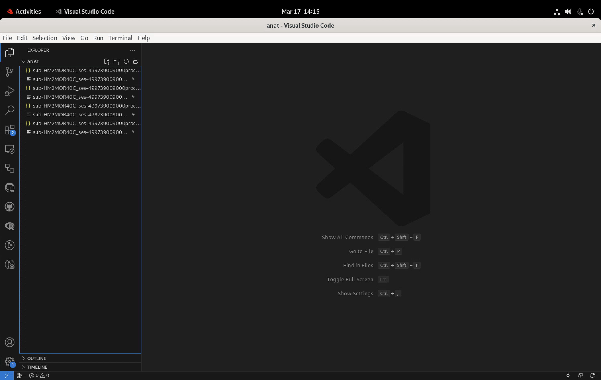
Then you click on the git icon on the left hand side right under the documents icon
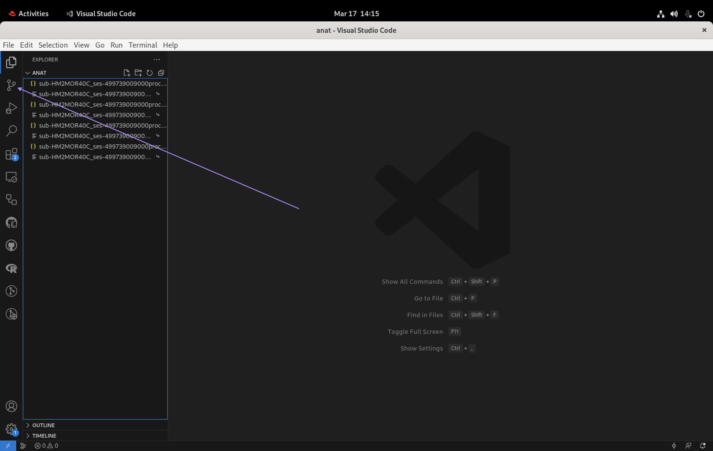
Then you click on 'branches' to see the list of saved changes. We will look for the 'Add nifti info' save since this is the stage we want to review.
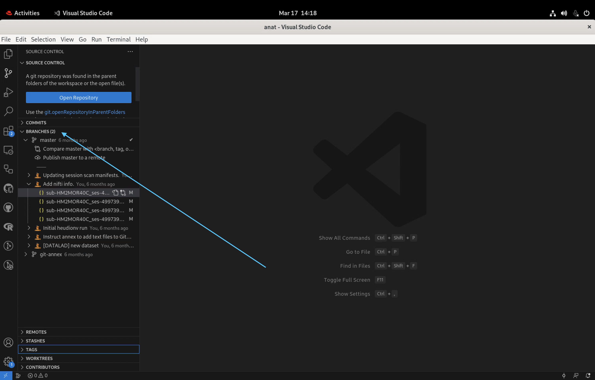
Then click on one of the JSONs listed underneath the 'Add nifti info' commit to see what has been changed between saves. On the left is the original document and the one of the right is the changed version. 
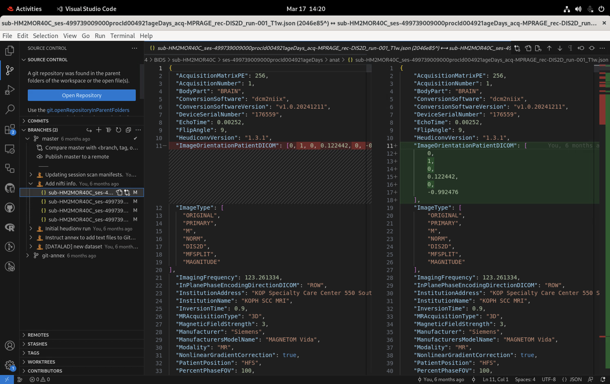

### cubids group {#group}
Here we are using the `config.yml` to group scans based on the similarities of their metadata. See docs for [cubids group](https://cubids.readthedocs.io/en/latest/cli.html#group) information. Output from this step is the `BIDS/code/CuBIDS` directory.

#### output {.unnumbered}
```
📁 BIDS
  ├── 📁 code
    ├── 📁 CuBIDS
      ├── 📄 run01_summary.tsv
      ├── 📄 run01_summary.json
      ├── 📄 run01_files.tsv
      ├── 📄 run01_files.json
      ├── 📄 run01_AcqGrouping.tsv
      ├── 📄 run01_AcqGrouping.json
      ├── 📄 run01_AcqGroupInfo.tsv
      └── 📄 run01_AcqGroupInfo.json
```

```{r run01-summary-tbl, eval=T, echo=F, fig.cap='run01_summary.tsv'}
DT::datatable(
  read_tsv("/mnt/isilon/bgdlab_processing/Dabriel/bgd_chop_curation/mydataset/BIDS/code/CuBIDS/run01_summary.tsv",
           show_col_types = FALSE) |>
    sample_n(50),
  filter = list(position = "top",
                settings = list(select = list(maxOptions = 10))),
  caption = "Run01 Summary",
  options = list(scrollX = TRUE,
                 autoWidth = TRUE))
```


### scan identification {#scan-id}
Here we are running a custom python script to further refine CuBIDS grouping and filename refinement. Outputs an edited version of `BIDS/code/CuBIDS/run01_summary.tsv` as `BIDS/code/CuBIDS/run01_summary_edited.tsv`
```{r run01-summary-edit-tbl, eval=T, echo=F, fig.cap='run01_summary_edited.tsv'}
DT::datatable(
  read_tsv("/mnt/isilon/bgdlab_processing/Dabriel/bgd_chop_curation/mydataset/BIDS/code/CuBIDS/run01_summary_edited.tsv",
           show_col_types = FALSE) |>
    sample_n(50),
  filter = list(position = "top",
                settings = list(select = list(maxOptions = 10))),
  caption = "Run01 Summary",
  options = list(scrollX = TRUE,
                 autoWidth = TRUE))
```


### cubids apply {#cubids-apply}
This is the active stage of file renaming based on the `cubids group` and scan identification step that generated the `run01_summary_edited` table and the `run01_files` table. 

#### batching {.unnumbered}
When there are more than 4000 scans, the cubids apply job is batched and `code/batch_cubids_apply_config.csv` is created to submit an array of cubids apply jobs. This involves splitting up the `run01_summary_edited` table into batches with an equal number of **RenameEntitySets** 
```{r batch-cubids, eval=T, echo=F, fig.cap="Config for batched CuBIDS"}
DT::datatable(read_csv("/mnt/isilon/bgdlab_processing/Dabriel/bgd_chop_curation/batch_cubids_apply_config.csv",
         show_col_types = FALSE),
          filter = list(position = "top",
                           settings = list(select = list(maxOptions = 10))),
         caption = "Batched CuBIDS Config Table",
         options = list(scrollX = '300px'))
```

#### output {.unnumbered}

Un-batched runs
```
📁 BIDS
  ├── 📁 code
    ├── 📁 CuBIDS
      ├── 📄 run01_summary.tsv
      ├── 📄 run01_summary.json
      ├── 📄 run01_files.tsv
      ├── 📄 run01_files.json
      ├── 📄 run01_AcqGrouping.tsv
      ├── 📄 run01_AcqGrouping.json
      ├── 📄 run01_AcqGroupInfo.tsv
      ├── 📄 run01_AcqGroupInfo.json
      ├── 📄 run02_summary.tsv
      ├── 📄 run02_summary.json
      ├── 📄 run02_files.tsv
      ├── 📄 run02_files.json
      └── 📄 run02_full_cmd.sh
      
```

Batched runs
```
📁 BIDS
  ├── 📁 code
    ├── 📁 CuBIDS
      ├── batch
        ├── 📄 batch1_files.tsv
        ├── 📄 batch1_summary_edited.tsv
        ├── 📄 run02_batch1_full_cmd.sh
        ├── 📄 run02_batch1_files.tsv
        ├── 📄 run02_batch1_files.json
        ├── 📄 run02_batch1_summary.tsv
        ├── 📄 run02_batch1_summary.json
        ├── 📄 run02_batch1_AcqGrouping.tsv
        ├── 📄 run02_batch1_AcqGrouping.json
        ├── 📄 run02_batch1_AcqGroupInfo.tsv
        ├── 📄 run02_batch1_AcqGroupInfo.json
        └── ...
      ├── 📄 run01_summary.tsv
      ├── 📄 run01_summary.json
      ├── 📄 run01_files.tsv
      ├── 📄 run01_files.json
      ├── 📄 run01_AcqGrouping.tsv
      ├── 📄 run01_AcqGrouping.json
      ├── 📄 run01_AcqGroupInfo.tsv
      ├── 📄 run01_AcqGroupInfo.json
      ├── 📄 run02_summary.tsv
      ├── 📄 run02_summary.json
      ├── 📄 run02_files.tsv
      ├── 📄 run02_files.json
      └── 📄 run02_full_cmd.sh
      
```

## Output: Filename Changes {#scan-names}

```{css, echo=FALSE}
.scroll-100 {
  max-height: 200px;
  overflow-y: auto;
  background-color: inherit;
}
```

Ultimately, CuBIDS and the scan identification process changes the names of files. After running `cubids apply` a bash script is created with `mv` commands to change filenames. Snapshot of the `BIDS/code/CuBIDS/run02_full_cmd.sh`:
```{r cat-full-cmd, eval=T, echo=F, message=F, warning=F, class.output="scroll-100"}
readLines("/mnt/isilon/bgdlab_processing/Dabriel/bgd_chop_curation/mydataset/BIDS/code/CuBIDS/run02_full_cmd.sh")
```

From that script we can see the changes for our example session:
```
mv anat/sub-HM2MOR40C_ses-499739009000procId004921ageDays_acq-TSE_rec-DIS2D_run-001_T2w.nii.gz \
  anat/sub-HM2MOR40C_ses-499739009000procId004921ageDays_acq-TSE3TScannerId176559Slices82Voxel0p573mm_rec-DIS2D_run-01_T2w.nii.gz
  
mv anat/sub-HM2MOR40C_ses-499739009000procId004921ageDays_acq-TSE_rec-DIS2D_run-001_T2w.json \ 
  anat/sub-HM2MOR40C_ses-499739009000procId004921ageDays_acq-TSE3TScannerId176559Slices82Voxel0p573mm_rec-DIS2D_run-01_T2w.json
  
mv anat/sub-HM2MOR40C_ses-499739009000procId004921ageDays_acq-TSE_rec-DIS2D_run-002_T2w.nii.gz \ 
  anat/sub-HM2MOR40C_ses-499739009000procId004921ageDays_acq-TSE3TScannerId176559Slices92Voxel0p625mm_rec-DIS2D_run-02_T2w.nii.gz
  
mv anat/sub-HM2MOR40C_ses-499739009000procId004921ageDays_acq-TSE_rec-DIS2D_run-002_T2w.json \
  anat/sub-HM2MOR40C_ses-499739009000procId004921ageDays_acq-TSE3TScannerId176559Slices92Voxel0p625mm_rec-DIS2D_run-02_T2w.json
  
mv anat/sub-HM2MOR40C_ses-499739009000procId004921ageDays_acq-MPRAGE_rec-DIS2D_run-001_T1w.nii.gz \
  anat/sub-HM2MOR40C_ses-499739009000procId004921ageDays_acq-MPRAGE3TScannerId176559Slices256Voxel0p901mm_rec-DIS2D_run-01_T1w.nii.gz
  
mv anat/sub-HM2MOR40C_ses-499739009000procId004921ageDays_acq-MPRAGE_rec-DIS2D_run-001_T1w.json \   
  anat/sub-HM2MOR40C_ses-499739009000procId004921ageDays_acq-MPRAGE3TScannerId176559Slices256Voxel0p901mm_rec-DIS2D_run-01_T1w.json

```

In general, our desired format for scan names is as follows the [BIDS template](https://bids.neuroimaging.io/getting_started/folders_and_files/files.html#filename-template) with a few customizations:

```
<subject-id>_<session-id>_acq-<ACQ><MFS>ScannerId<SCANNER>Slices<DIM3>Voxel<Voxel1>mm_rec-<REC>_run-<RUN>_<suffix>.<extension>
```

where:   
  - `subject_id` is the `pat_id` from Arcus prefixed by 'sub-'   
  - `session_id` is the `proc_ord_id` and `proc_ord_age` from Arcus prefixed by 'ses-', separated by 'procId' and suffixed by 'ageDays'. `proc_ord_age` is padded by zeros for to make 6 digits   
  - `ACQ` is the acquistion type based on the sequence run while the patient was getting scanned   
  - `MFS` is the `MagneticFieldStrength` from the DICOM metadata either **1p5T** or **3T**   
  - `SCANNER` is the serial number of the scanner the patient was in from the DICOM/JSON field `DeviceSerialNumber`   
  - `DIM3` is the number of slices acquired per sequence run from the JSON metadata field `Dim3Size` & DICOM field `Dim3`   
  - `Voxel` is the size of the voxels the sequence acquired from the JSON metadata field `VoxelSizeDim1` & DICOM field `SliceThickness`   
  - `REC` is the image reconstruction technique from the DIOMC/JSON metadata field `ImageType`   
  - `RUN` is the run number of the scan   
  - `suffix` is the type of scan acquired, (e.g. T1w, T2w, FLAIR, dwi, etc)   
  - `extension` is either json for the JSON or nii.gz for the NifTI   

Sometimes scans will have additional keys such as:   
  - `ce-gad` referring to the scan occurring after contrast injection where 'gad' refers to the gadolonium that is used to increase image contrast for diagnostic imaging   
  - `sample-fetal` referring to scans of fetal brains   
  - `mt-on` referring to magnetization transfer during a sequence   


## Saving Progress {#save-cubids}
Now we're done with CuBIDS we can save our dataset!
```{bash save-cubids, eval=F, include=T}
srun --time 12:00:00 --mem 5G datalad save -m 'cubids apply run01' -r -J auto
```
We are saving these changes recursively to the top level `BIDS` dataset so each sub-dataset saves. For the `cubids group` step, the script does a top level save only thus when your in the `BIDS` directory, running `git log --oneline` returns:
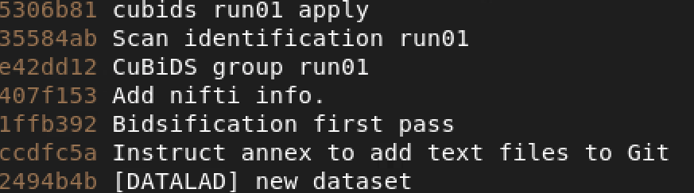
versus when in the `BIDS/sub-HM2MOR40C` the log reads:
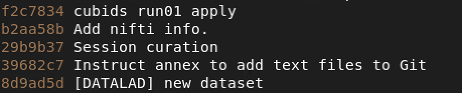
We can see that there is no commit for the 'CuBiDS group run01' step since that was only a top level save and not a recursive sub-dataset save.


Now we continue to the next stage! ➡️


## Behind The Scenes {#cubids-bts}
Behind the scenes are 4 local scripts, 6 containerized scripts/dictionaries, and 1 containerized python packages

### Local Scripts {#cubids-local-scripts}

#### `code/run-cubids-prep.sh`
  1. Runs `code/run-clin-dataorg.py` **_cubids-prep_** command    
  2. If previous command successfully completes, runs **_cubids-apply_** command. Upon error, script stops  
  
#### `code/run-clin-dataorg.py`
  1. Concatenates subject specific heudiconv performance tables[^3] into `proc_summary.tsv` and removes the individual tables after concatenation.   
  2. Makes table with filenames for any `problemtatic_scans`.  
  3. Removes heudiconv run incrementors in the `/mnt/isilon/bgdlab_processing/Data/tmp_heudiconv` space.  
  4. Runs `cubids add-nifti-info` within the container, saving changes in datalad if run successfully, quits upon failure.   
  5. Runs `cubids group` within the container, saving changes in datalad if run successfully, quits upon failure      
  6. Runs `identifyFilesFromCubids.py` within the container, saving changes in datalad if run successfully, quits upon failure   
  7. Runs `code/cubids-apply.sh` script on the entire dataset if number of files less than 4000. Else, it creates 10 batches with equal number of subjects to speed up the process   

#### `code/cubids-apply.sh`
  1. Runs `cubids apply` within the container on either the entire dataset or an individual batch using an array config file output from the **_cubids-prep_** command   

#### `code/batch-cubids-combine.sh`
  1. Runs `code/run-clin-dataorg.py` **_combine_** command to concatenate CuBIDS batches   

[^3]: See [heudiconv logs](#heudi-logs) for table description

  
  
### Containerized Scripts {#cubids-contain-scripts}
  1. `config.yml`   
    - Config file required to run `cubids group` specify which metadata to aggregate and tolerance ranges to apply   
  2. `identifyFilesFromCubids.py`   
    - Script that looks to identify specific sequences specifed in the parameter range table using custom tolerance ranges that couldn't be specified in the CuBIDS config   
  3. `parameter_ranges.tsv`   
    - The metadata for the most common sequences within CHOP imaging data along with tolerance ranges to identify unknown scans and to label standard/variant scans   
  
### Containerized Python Packages {#cubids-contain-packs}
  1. CuBIDS   
    - Custom version of CuBIDS   
  