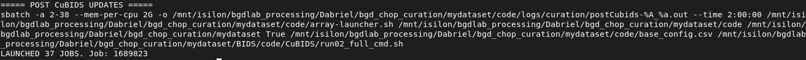
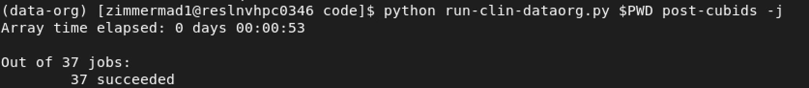
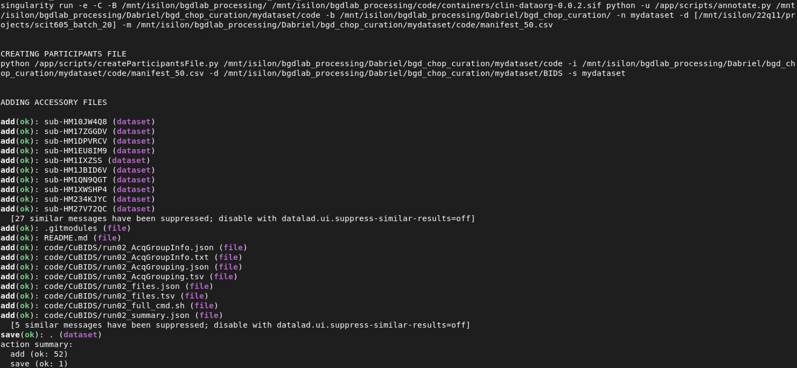

# Post-CuBIDS {#post-cubids}

After CuBIDS changes the names of scans and associated JSONs, we have to manually update the session specific `scans.tsv` tables with the new filenames. In this step we update this table and check if any BIDS keys[^4] were removed from the filename so that we can add them back in. 

[^4]: refer to the BIDS template for possible [BIDS keys](https://bids.neuroimaging.io/getting_started/folders_and_files/files.html#filename-template)

```{r scans-tbl, eval=T, echo=F, fig.cap="Scans summary table"}
DT::datatable(read_tsv("/mnt/isilon/bgdlab_processing/Dabriel/bgd_chop_curation/sub-HM2MOR40C_ses-499739009000procId004921ageDays_scans.tsv",
          show_col_types = FALSE),
           filter = list(position = "top",
                            settings = list(select = list(maxOptions = 10))),
          caption = "Scans Table",
          options = list(scrollX = '300px'))
```


## Main Command {#pc-cmd}
```{bash pc-cmd, eval=F}
python run-clin-dataorg.py $PWD post-cubids \
	-b $BASE_DIR \
	-n mydataset \
	-mm $BASE_DIR/mydataset/BIDS/code/CuBIDS/run02_full_cmd.sh

```
Now we encounter a new argument `-mm $CUBIDS_FULL_CMD` which refers to the command script output from running `cubids apply` in the previous chapter. We use this to compare our new filenames to the old filenames to see if any BIDS keys were removed. If so, we add those keys back into the filename. This rarely happens in this second version of the data-org container but is retained in the script for backwards compatibility with the first version of the container.  

<div style="padding: 15px; border: 1px solid #ccc; background-color: #f9f9f9; border-left: 5px solid #337ab7;">
  <p style="margin-top: 0; color: #337ab7;"><strong>💡 Tip</strong></p>
  <p>You can set global variables before running commands to shorten the lengths of arguments, e.g. `/mnt/isilon/bgdlab_processing/Dabriel/bgd_chop_curation/mydataset/BIDS/code/CuBIDS/run02_full_cmd.sh` becomes `-mm $BASE_DIR/mydataset/BIDS/code/CuBIDS/run02_full_cmd.sh` </p>
</div>

After running the command, output is information for the array of jobs launched to edit each subjects' session directories. 


Since these jobs are doing pretty simple tasks, they finish quickly. To make sure they finished successfully instead of failing due to errors, run this to check the job status, updating the `postCubids_job_summary.tsv`
```{bash pc-check-stat, eval=F}
python run-clin-dataorg.py $PWD post-cubids -j
```

Also output are logs for the jobs `code/logs/curate/postCubids-<jobid>_<arrayid>.out`
```{r cat-pc-logs, eval=T, echo=F, warning=F, message=F, class.output="scroll-100"}
readLines("/mnt/isilon/bgdlab_processing/Dabriel/bgd_chop_curation/mydataset/code/logs/curation/postCubids-1689823_10.out")
```

## Save Progress
Now we save our progress by switching into the `BIDS` directory and running:
```{bash pc-save, eval=F}
srun --time 12:00:00 --mem 5G datalad save -m 'Post CuBIDS updates' -r -J auto
```

Now we continue to the next stage! ➡️


# Annotation {#annot}
Now for the final stage we annotate the dataset creating the [data summary](https://bids-specification.readthedocs.io/en/stable/modality-agnostic-files/data-summary-files.html) and [data description](https://bids-specification.readthedocs.io/en/stable/modality-agnostic-files/dataset-description.html) files required by BIDS.

## Main Command {#annot-cmd}
```{bash annot-cmd, eval=F}
python run-clin-dataorg.py $PWD annotate \
	-b $BASE_DIR \
	-n mydataset \
	-m $MANIFEST \
	-d $DICOMS
```

Output is the singularity command run to create the `participants.tsv`. Then static copies of the `participants.json` and `scans.json` are copied from the container. The `README.md` and `CHANGES` are customized to the dataset based on the list of dicoms, input manifest, and final subject/session numbers from the `participants.tsv`. Dataset is saved after changes are made automatically. Note that this isn't a recursive datalad save, these changes are only registered to the top level `BIDS` dataset since the individual sessions aren't being changed. 




We don't follow _all_ the rules per BIDS specification but we still need to have all the required files. The only file we currently don't make is the `sessions.tsv` table that goes into each subject directory.
```
📁 sub-HM2MOR40C
  ├── ses-499739009000procId004921ageDays
    ├── 📁 anat
      ├── 📄 sub-HM2MOR40C_ses-499739009000procId004921ageDays_scans.tsv ✅
      └── ...
    └── 📄 sub-HM2MOR40C_sessions.tsv ❌
```
In the future this can be changed so that we are more accurately following [BIDS longitudinal standards](https://bids-specification.readthedocs.io/en/stable/longitudinal-and-multi-site-studies.html#longitudinal-and-multi-site-studies)

Our example participants file
```{r participants-file, eval=T, echo=F, fig.cap="participants file"}
DT::datatable(read_tsv("/mnt/isilon/bgdlab_processing/Dabriel/bgd_chop_curation/mydataset/BIDS/participants.tsv",
          show_col_types = FALSE),
           filter = list(position = "top",
                            settings = list(select = list(maxOptions = 10))),
          caption = "Participants File",
          options = list(scrollX = '300px'))
```

Here is the `README.md` where you will need to change the **TO_DO** to your name as the curator of the dataset (or multiple names if applicable).
```{r cat-readme, eval=T, echo=F, warning=F, message=F, class.output="scroll-100"}
readLines("/mnt/isilon/bgdlab_processing/Dabriel/bgd_chop_curation/mydataset/BIDS/README.md")
```

Here is the `CHANGES` where only a single commit message is written. If you have to change anything in the dataset, it should be noted in this document (along with saving the changes in datalad.)
```{r cat-changes, eval=T, echo=F, warning=F, message=F, class.output="scroll-100"}
readLines("/mnt/isilon/bgdlab_processing/Dabriel/bgd_chop_curation/mydataset/BIDS/CHANGES")
```
