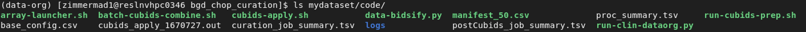
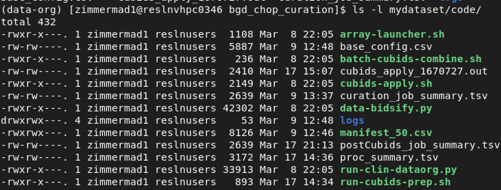
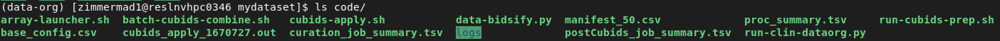
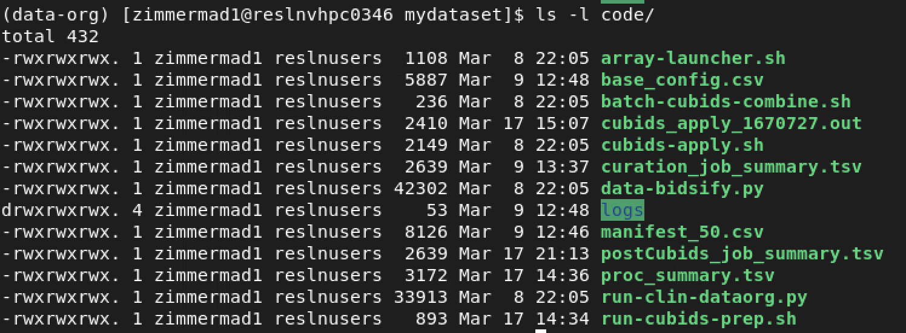

# Collaboration {#collab}

When multiple users are operating on the same dataset, there can be some issues.  

First, after running any stage, look at the color the directories and files are highlighted.  



In the example, files are white, directories are blue. This means that the only user who can edit/delete these files and directories is the one who created them. Respublica by default gives everyone in the BGDLab group read permissions, but you will have to manually grant write (edit) permissions. Files that are green are executable. You can also run `ls -l` to list the permissions. 

where each group of 3 letters (after the first character which just means file or directory) refers to access permissions so _-rwxr-x- - -_ means there are read, write permissions for the user (creator) and read and execute permissions for the group, and no permission for others.   

To change permissions, run `chmod 777 -R .` while in your top level directory `$BASE_DIR/mydataset` for this example.   
 

Now the directories and files are highlighted in green text indicating that there are now group write permissions! And now the permissions are listed as _-rwxrwxrwx._   


Review [linux file permissions](https://www.redhat.com/en/blog/linux-file-permissions-explained) for more information.  

After doing this it's good practice to go into the `BIDS` and `sourcedata` datasets to do a top level only save mentioning that permissions were updated.
```
datalad save -m 'granted write permission' -J auto
```

## Debugging

Sometimes after trying to save a datalad dataset, you'll get an error that will suggest a command to run to correct that error. The command should resemble the one below, you can copy and paste the suggested command that then run it before running the original datalad save command again
```
find ${PWD} -name '.git' -type d -exec bash -c 'git config --global --add safe.directory ${0%/.git}' {} \;
```

