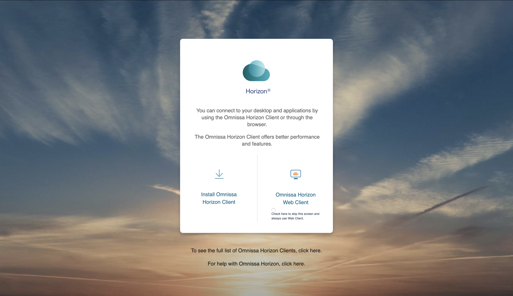
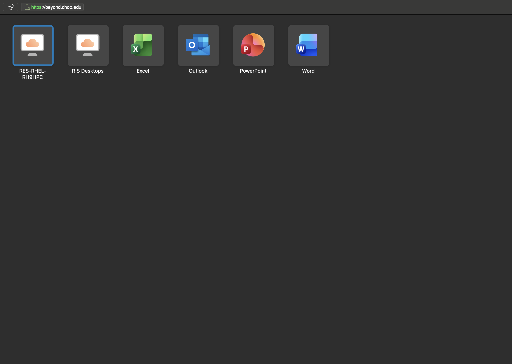
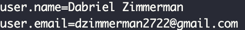
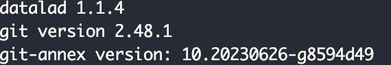
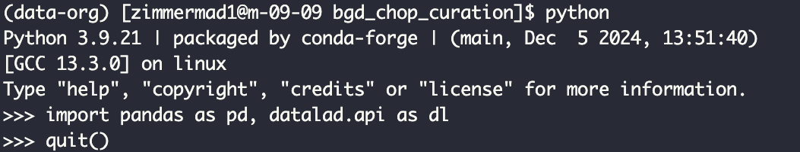
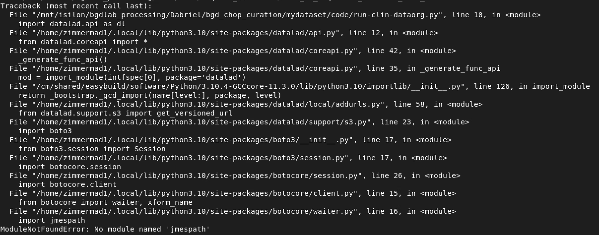
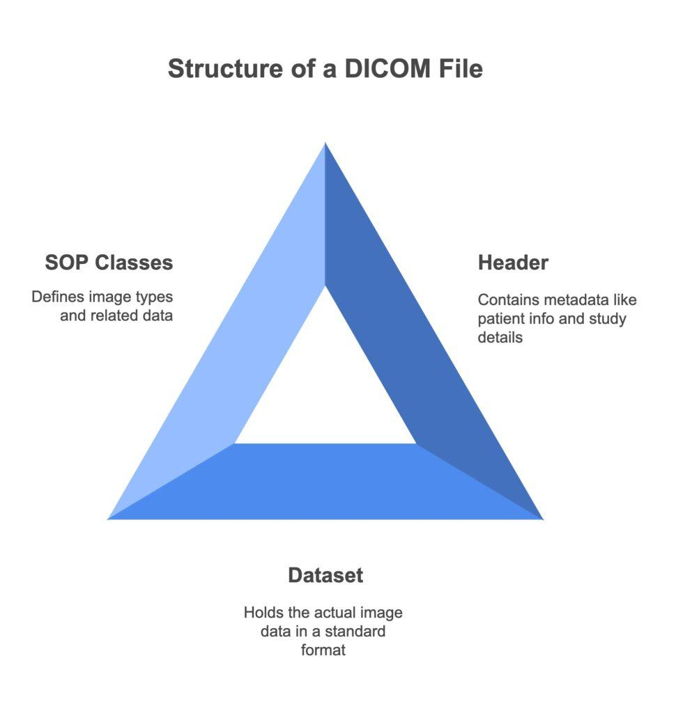

--- 
title: "BGDLab Data Curation"
author: "Dabriel Zimmerman"
date: "`r Sys.Date()`"
site: bookdown::bookdown_site
documentclass: book
bibliography: [book.bib, packages.bib]
# url: your book url like https://bookdown.org/yihui/bookdown
# cover-image: path to the social sharing image like images/cover.jpg
description: |
  Walkthrough of BGDLab data curation, specific for imaging data from CHOP.
link-citations: yes
github-repo: rstudio/bookdown-demo
---

# Introduction

This walkthrough will help you understand the data curation process as well as the underlying infrastructure. 

First a brief overview of Respublica. 

## Using Respublica

```{r setup, include=FALSE}
# automatically create a bib database for R packages
library(dplyr)
library(tidyverse)
library(DT)
library(readr)
library(reticulate)
library(kableExtra)
library(DT)
# knitr::opts_chunk$set(echo=F, 
#                       include=F,
#                       eval=F)
knitr::write_bib(c(.packages(), 
                   'bookdown', 
                   'knitr', 
                   'rmarkdown'), 
                 'packages.bib')
```


### How to Access {#res-access}
Respublica is the CHOP high performance cluster (HPC) where the lab stores all the raw and processed imaging data and associated statistical models, code, and analytical output. A thorough overview of using the Respublica can be found on the internal [CHOP wiki](https://wiki.chop.edu/spaces/RISUD/pages/261754457/Start+Here+What+is+HPC). 

You can access Respublica on a CHOP device after activating the VPN. If it is the first time you've logged into Respublica, you will need to download Omnissa, the app to connect you to Respublica (this will only work on CHOP devices while on the VPN). To download Omnissa, go to [Beyond](beyond.chop.edu) and download the client. 



When you open the app, you'll login using your CHOP password. You will be brought to a homescreen where you'll open the RES-RHEL-RH9HPC server which will take you into Respublica! From there you can open a terminal which is where you will be curating data. 



<div style="padding: 15px; border: 1px solid #ccc; background-color: #f9f9f9; border-left: 5px solid #337ab7;">
  <p style="margin-top: 0; color: #337ab7;"><strong>🔑 Note</strong></p>
  <p>Since this is a virtual machine (VM), regular Copy/Paste shortcuts won't work. On a MacBook, you will need to use shift+control+C to copy and shift+control+V to Copy/Paste in Respublica. You won't be able to copy from the terminal on the VM to your local machine. </p>
</div>


If on a non-CHOP device, you can access Respublica 2 ways:   
  1) through [Respublica On Demand](https://respublica-web2.research.chop.edu) or   
  2) through the browser on [Beyond](beyond.chop.edu)       

When on the browser, you won't be able to Copy/Paste things into the terminal at all. You also won't be able to copy or move files from Respublica to your local machine. Your best bet is probably to use Respublica on Demand and open an interactive VSCode session where you will be able to Copy/Paste between virtual and local machines. Then you can use the Files tab to download/upload between virtual and local machines.

<div style="padding: 15px; border: 1px solid #ccc; background-color: #f9f9f9; border-left: 5px solid #337ab7;">
  <p style="margin-top: 0; color: #337ab7;"><strong>🔑 Note</strong></p>
  <p>We don't have admin privilages on Respublica so things like Docker and sudo commands will not work. </p>
</div>


## Environment Creation {#create-env}
To be able to curate a dataset, you will need to setup a virtual environment that will contain packages needed to launch the process. 

1. Install conda
```{bash install-conda, include=T, eval=F}
cd $HOME
wget https://repo.continuum.io/miniconda/Miniconda3-latest-Linux-x86_64.sh
bash Miniconda3-latest-Linux-x86_64.sh

source ~/miniconda3/etc/profile.d/conda.sh
```

2. Create `data-org` environment
You will need to create the data-org environment using the default environment packages located here `/mnt/isilon/bgdlab_processing/Data/SLIP/dataorg-environment-2024.yml`
```{bash create-env, include=T, eval=F}
conda env create -f /mnt/isilon/bgdlab_processing/Data/SLIP/dataorg-environment-2024.yml
conda activate data-org
```

Next we will need to setup git so that we can use datalad. You can run `git config --global --list` to check if you have already setup git. 


If you haven't already setup git, run the following commands, replacing the "John Doe" information with your own name and email.
```{bash check-git, include=TRUE, eval=F}
git config --global user.name "John Doe"
git config --global user.email johndoe@example.com
```

3. Check package versions
We will also check the versions of the packages in the conda environment we just created to ensure things loaded properly. 
```{bash version-check, include=TRUE, eval=F}
datalad --version
git --version
git-annex version
```



Next check on python libraries by opening a python terminal. If there are installation errors, StackOverflow and Google are your best bet to a solution.
```{bash py-check, include=T, eval=F}
python
import pandas as pd, datalad.api as dl
exit()
```



<div style="padding: 15px; border: 1px solid #ccc; background-color: #f9f9f9; border-left: 5px solid #337ab7;">
  <p style="margin-top: 0; color: #337ab7;"><strong>🔑 Note</strong></p>
  <p>One of the most important things is package version control. Different versions of packages can prevent the curation process from running at all or produce difference in the same data curated with the same process but with different packages.</p>
</div>


If anything happens to your environment and packages upgrade or downgrade, errors like the one below can occur. This happens because the python version upgraded to 3.10 from 3.9.21.

If this happens, you'll have to recreate the environment. Known things that will cause this is by installing Jupyter while the environment is active (or any package that requires a version of python more recent than 3.9.21)


Now a few basic definitions

## References {#refs}
This resource is meant to explain the BGDLab's clinical imaging process, but not go in depth in all underlying systems and components of a clinical imagign dataset. The resources below are good to review to orient yourself to everything included in the following chapters

* [MRI for Neuroscience](https://case.edu/med/neurology/NR/MRI%20Basics.htm)  
* [Imaging Sequences](https://radiopaedia.org/articles/mri-sequences-overview?lang=us)  
* [MR Physics](https://www2.psychology.uiowa.edu/classes/31231/Readings/0829_Functional%20Magnetic%20Resonance%20Imaging_Huettel_Ch5.pdf)  
* [SLURM](https://slurm.schedmd.com)  
* [BIDS](https://bids.neuroimaging.io)  
* [datalad](https://docs.datalad.org/en/stable/index.html)  
* [git](https://git-scm.com/docs)  

### DICOM {#dicom}

From [RADSOURCE](https://radsource.us/understanding-dicom-what-is-the-dicom-file-format/)

> DICOM, or Digital Imaging and Communications in Medicine, is a standardized protocol used for managing, storing, printing, and transmitting information in medical imaging. This standard ensures that medical imaging devices from different manufacturers can communicate seamlessly, enabling efficient and accurate transfer of imaging data. In hospitals and clinics worldwide, DICOM is the backbone of medical imaging, crucial for maintaining a smooth and effective workflow. DICOM applies to images from a variety of medical equipment, from X-ray machines to ultrasound scanners and MRI equipment. All of those images are subject to the DICOM format. 


[List of DICOM metadata](https://www.dicomlibrary.com/dicom/sop/)

### NifTI {#nifti}

[The NIFTI file format](https://brainder.org/2012/09/23/the-nifti-file-format/)   
A NIfTI (Neuroimaging Informatics Technology Initiative) is a data format for the storage of magnetic resonance imaging and other medical images.
